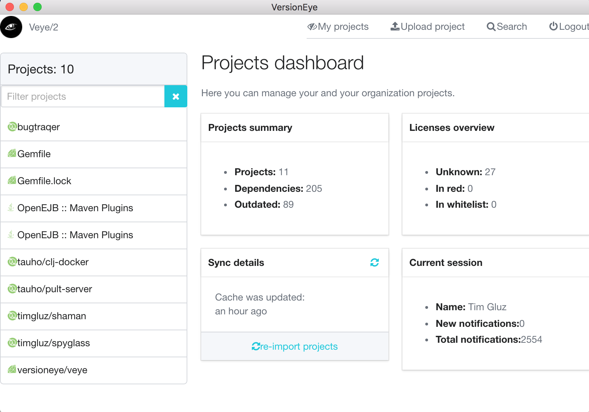

# veye2

[**Still prototype**]

Desktop application for VersionEye. In near power it should bring VersionEye's functionality on your desktop, will take advantage of your package managers and brings the original Veye command-line tool to next level.

Planned features for 1st release:

* support for VersionEye projects & search;
* upload and track projects on local disk;



## Development

#### setting up environment

1) set up Electron

```
npm install
grunt download-electron
```

2) build clojurescript

```
lein cljsbuild once
```

3) run figwheel

```
lein trampoline figwheel frontend
```

4) run app

```
#windows
.\electron\electron.exe app

#Linux
./electron/electron app

#OSX
./electron/Electron.app/Contents/MacOS/Electron app
```

## License

Copyright ©  FIXME

Distributed under the Eclipse Public License either version 1.0 or (at
your option) any later version.
